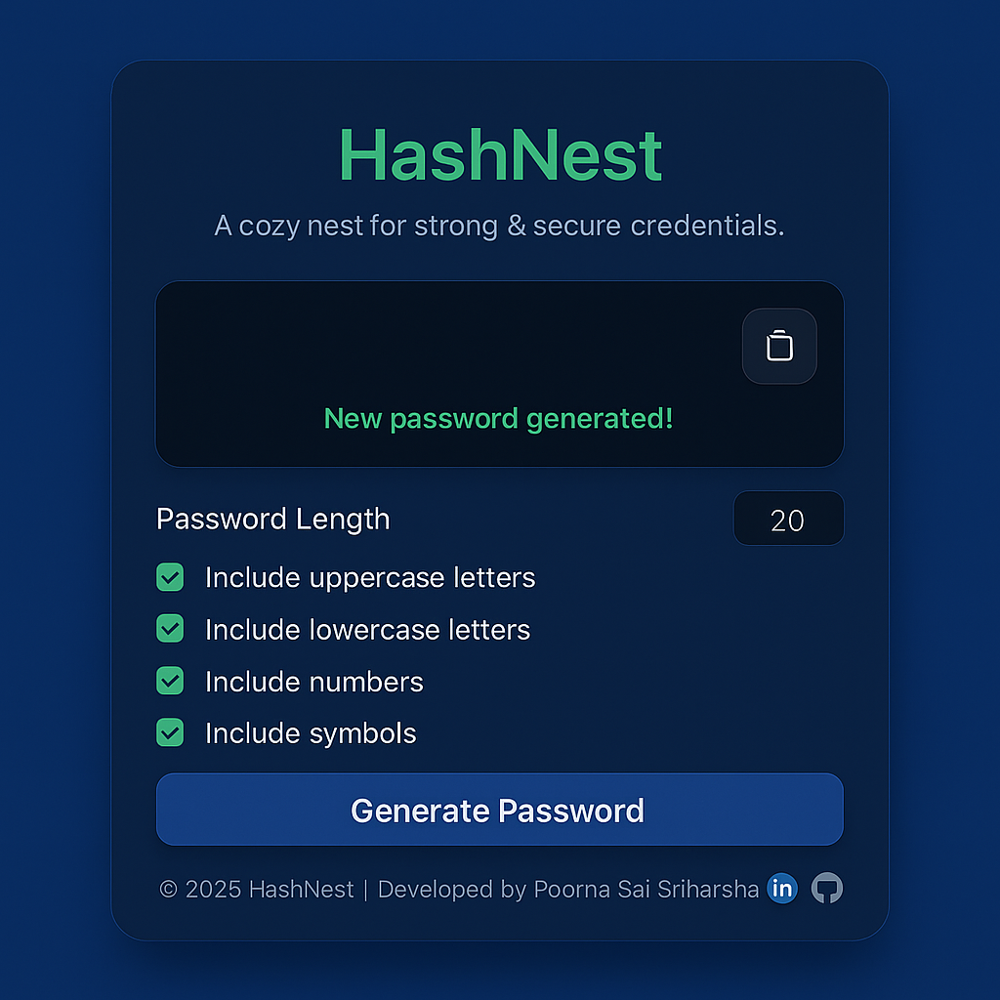

# 🔐 HashNest
Developed HashNest, a visually appealing and fully responsive web-based password generator with advanced customization options, clipboard integration, and modern UI/UX enhancements using HTML, CSS, and JavaScript.
## 🚀 Live Demo
For Live demo:- https://poorna-sai-sriharsha.github.io/HashNest/

## 📸 Screenshots

## ✨ Features 
- ✅ Generate secure passwords with customizable length. 
- 🔠 Toggle character types: Uppercase, Lowercase, Numbers, Symbols. 
- 📋 Copy password to clipboard with visual feedback. 
- 🎨 Modern glassmorphism UI design. 
- 📱 Fully responsive and mobile-friendly layout. 

## 🧠 How It Works 
- HashNest allows users to configure password criteria by selecting desired character types (uppercase, lowercase, numbers, symbols) and password length. 
- The generator ensures at least one character from each selected category is included for security. 
- The remaining characters are randomly selected from the chosen types, and the final password is shuffled using a Fisher-Yates algorithm to ensure unbiased randomization. 
- Users can copy the generated password to their clipboard with a single click, accompanied by visual feedback for a seamless experience. 

## 🛠️ Built With 
- HTML5 
- CSS3 (Glassmorphism, Responsive Design) 
- JavaScript (ES6+) 
- Font Awesome (https://fontawesome.com/) for icons 
- Google Fonts(https://fonts.google.com/) – *Poppins*, *Roboto*

## 🧰 Getting Started
- To run this project locally:- 
- Clone the repo git clone https://github.com/Poorna-Sai-Sriharsha/HashNest.git 
- Navigate to the project directory cd HashNest 
- Open index.html in a browser or use a local server (e.g., npx live-server) for the best experience. 
- Note: No additional dependencies are required, as all libraries are included via CDNs.

## 🧪 Testing & Deployment
- Tested for compatibility across Chrome, Firefox, Safari, and Edge. 
- Verified responsive design on mobile (iOS, Android) and desktop devices. 
- Deployed using GitHub Pages for seamless access and live demo availability. 

## 📖 What I Learned
- Implemented secure password generation with randomization and ensured inclusion of selected character types. 
- Mastered Glass-morphism design techniques using CSS for a modern, visually appealing UI. 
- Enhanced skills in responsive design with CSS media queries and flexible layouts. 
- Overcame challenges in optimizing clipboard functionality for cross-browser compatibility. 

## 🤝 Contributing
- Contributions are welcome! Please fork the repository and submit a pull request with your changes. For major updates, open an issue first to discuss your ideas.
